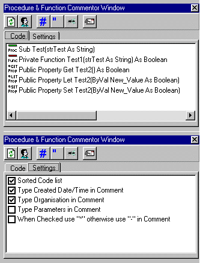



## Code Commentor Add\-in

### Description

Comment any line of code in your project
 
### More Info
 
This Add-in is written in VB6 and sp4.

You have to manualy register the add-in dll.

First copy the RBVBCommentor.dll to the \WINDOWS\SYSTEM32 or \WINNT\SYSTEM32 directory.

In the SYSTEM32 directory type REGSVR32 RBVBCommentor.dll.

If the registration is succeeded, start Visual Basic and activate the add-in.

In some cases the add-in is not shown in the add-in manager.

To make it visible, go to the \WINDOWS or \WINNT directory and edit the VBADDIN.INI.

Add the following key; RBVBCommentor.Connector=0.

Restart Visual Basic and activate the Add-in.

             |
---                |---
**Submitted On**   |2000-07-25 09:54:02
**By**             |[REBO](https://github.com/Planet-Source-Code/PSCIndex/blob/master/ByAuthor/rebo.md)
**Level**          |Intermediate
**User Rating**    |3.8 (15 globes from 4 users)
**Compatibility**  |VB 6\.0
**Category**       |[VB function enhancement](https://github.com/Planet-Source-Code/PSCIndex/blob/master/ByCategory/vb-function-enhancement__1-25.md)
**World**          |[Visual Basic](https://github.com/Planet-Source-Code/PSCIndex/blob/master/ByWorld/visual-basic.md)
**Archive File**   |[CODE\_UPLOAD81287252000\.zip](https://github.com/Planet-Source-Code/rebo-code-commentor-add-in__1-10042/archive/master.zip)

